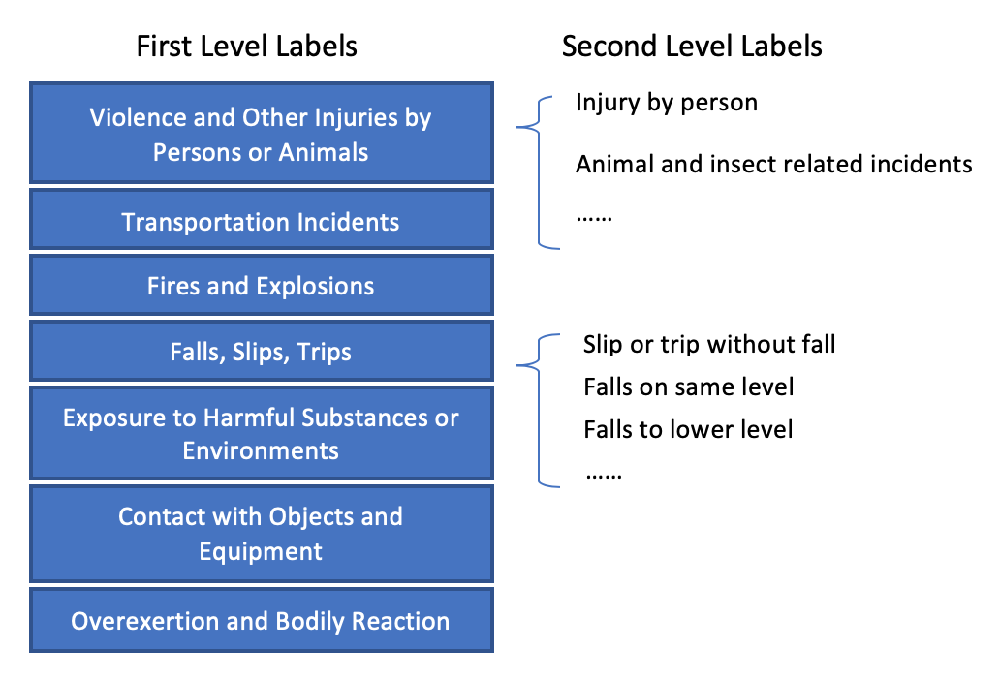

```{r setup, include=FALSE}
knitr::opts_chunk$set(echo = TRUE)
```


```{r,warning=FALSE,include=FALSE}
library(readr)
library(tm)
library(SnowballC)
library(ROCR)
library(glmnet)
library(rmarkdown)
library(knitr)
```

### <span style = "color:purple">1. Overview</span>
\small
Every day, work-related injury records are generated. **In order to alleviate the human effort expended with coding such records**, the Centers for Disease Control and Prevention (CDC) National Institute for Occupational Safety and Health (NIOSH), in close partnership with the Laboratory for Innovation Science at Harvard (LISH), is interested in **improving their NLP/ML model to automatically read injury records and classify them** according to the Occupational Injury and Illness Classification System (OIICS). <span style = "color:purple">Our project is inspired by this initiative.</span>


This project represents a **text classification** problem that is expected to be solved using efficient **big dataset** handling techniques and various **classificiation algorithms**. Through exploration, we hope to achieve better accuracy and higher efficiency in injury records classification.

### <span style = "color:purple">2. Data Inspection</span>

A random sample of 153,956 records with the outcome event column included. The data have 4 column (text, age, sex and a response label): We have 48 unique OIICS response label in total. 

\scriptsize
```{r, size='scriptsize'}

Train <- read.csv("CDC_Text_ClassificationChallenge_TrainData.csv")
head(Train, 3)
dim(Train)[1]
summary(Train$age)

```
\small
The response variable is hierarchical (for example, if one label is 32, then it belongs to the third class "Fires and Explosions", and the second type)

```{r echo=FALSE, out.width='60%', fig.align="center"}

```

```{r}


```


## Data Processing and Prelimiary Analysis [1] Tian

## Approach [1] Tian, Chang

## Result [1] Tian, Chang, Sidi

## Conclusion and Future [1/3] Sidi
