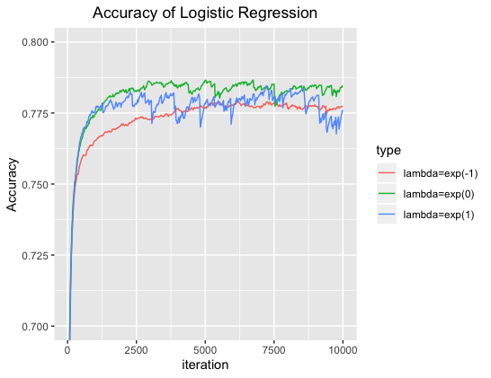

```{r setup, include = FALSE}
knitr::opts_chunk$set(echo = TRUE)
```


```{r, warning = FALSE,include = FALSE}

library(readr)
library(tm)
library(SnowballC)
library(ROCR)
library(glmnet)
library(rmarkdown)
library(knitr)
library(ggplot2)
library(grid)
library(gridExtra)
library(png)

```

### <span style = "color:purple">1. Overview</span>
\small
Every day, work-related injury records are generated. **In order to alleviate the human effort expended with coding such records**, the Centers for Disease Control and Prevention (CDC) National Institute for Occupational Safety and Health (NIOSH), in close partnership with the Laboratory for Innovation Science at Harvard (LISH), is interested in **improving their NLP/ML model to automatically read injury records and classify them** according to the Occupational Injury and Illness Classification System (OIICS). <span style = "color:purple">Our project is inspired by this initiative.</span>


This project represents a **text classification** problem that is expected to be solved using efficient **big dataset** handling techniques and various **classificiation algorithms**. Through exploration, we hope to achieve better accuracy and higher efficiency in injury records classification.

### <span style = "color:purple">2. Data Inspection</span>

A random sample of 153,956 records with the outcome event column included. The data have 4 column (text, age, sex and a response label): We have 48 unique OIICS response label in total. Given that the records were collected through document scanning, many spelling errors are included. For example, "S P" in record 3 (shown below).   

\scriptsize
```{r, size = 'scriptsize'}

Train <- read.csv("./data/CDC_Text_ClassificationChallenge_TrainData.csv")
head(Train, 3)
dim(Train)[1]
summary(Train$age)

```
\small
The response variable is hierarchical (for example, if one label is 32, then it belongs to the third class "Fires and Explosions", and the second type). Figure on the left is showing the 7 first level labels and a few second level labels (48 in total). Although there are 48 possible outcomes, the frequencies is extremely unbalanced, as shown in the figure on the right. This needs to be taken into account while training different models. 

```{r, include = FALSE}

load(file = "data/vector.rda")

VectorCountPlot <- ggplot(vector, aes(x = V2, y = sample_vector)) + geom_bar(stat = "identity", color = "white", fill = "lightblue") + theme(plot.title = element_text(hjust = 0.5))
print(VectorCountPlot + ggtitle("Count of Each Category") + labs(y = "count", x = "Category Label"))
ggsave("plot/vector.png")

img1 <- rasterGrob(as.raster(readPNG("./plot/response_data.png")), interpolate = FALSE)
img2 <- rasterGrob(as.raster(readPNG("./plot/vector.png")), interpolate = FALSE)

```

```{r echo = FALSE, out.width = '100%', fig.align = "center"}
grid.arrange(img1, img2, ncol = 2)
```


### <span style = "color:purple">3. Data Processing and Prelimiary Analysis</span>  [1] Tian

```{r echo = FALSE, out.width = '55%', fig.align = "center"}
load(file = "data/freq.rda")

sorted_freqs_1 = sort(freqs_1, decreasing = TRUE)
sorted_freqs_1 = data.frame(names(sorted_freqs_1), sorted_freqs_1)[1:50,]
rownames(sorted_freqs_1) <- c(1:50)
colnames(sorted_freqs_1) <- c("word","frequency")

sorted_freqs_1$word  <- as.character(sorted_freqs_1$word)
sorted_freqs_1$word <- factor(sorted_freqs_1$word, levels = c(sorted_freqs_1$word))

ggplot(sorted_freqs_1, aes(x = factor(word), y = frequency, group = 1)) + geom_line(color = "lightblue", size = 3.5) + geom_point(color = "lightblue", size = 3) + theme(axis.text.x = element_text(angle = 90, hjust = 1), plot.title = element_text(hjust = 0.5)) + ggtitle("Word Frequency") + labs(y = "frequency", x = "word")

```


**a) Dimension reduction:** 
For traditional methods, we will use document-word matrix as input. Although we use **sparse matrix** to store it, it is still "big". Thus we may try some dimension reduction methods:

   + We tried **LDA (Linear Discriminant Analysis)** to project high-dimensional, sparse data to a low-dimensional, dense space, supervised by training data;
   + We also tried **ANOVA test** on every single word and keep the significant ones only, which can reduce the dimension from 6000 to 2000.
   + But both methods reduce the accuracy in fact, due to the loss of information. Considering **lasso penalty** can choose the informative feature automatically, we finally decided to use lasso penalty only rather than any other dimension reductions.
For NLP methods, they don't process data as matrix, thus their corresponding "dimension reduction" is just different kinds of pre-processings.


### <span style = "color:purple">4. Approach</span>  [1] Tian, Chang, Sidi

**a) Logistic regression**

Firstly, we applied logistic regression. The logistic regression assume that data have the following distributions:$$ P(Y_i=j) = \frac{exp(x_i^T\beta_j)}{\sum_{m=1}^{k}exp(x_i^T\beta_m)}$$
We want to **maxmize** the object function:$$max \ Likelihood = \Pi_{i=1}^{n} \Pi_{j=1}^{k}[P(Y_i=j)]^{1_{Y_i=j}}$$
Or **minimize** the loss function:$$min \ Loss = -\sum_{i=1}^{n} \sum_{j=1}^{k}1_{Y_i=j}\times log[P(Y_i=j)]$$

  **Logistic regression with penalty,** Group lasso:$$min \ Loss = -\sum_{i=1}^{n} \sum_{j=1}^{k}1_{Y_i=j}\times log[P(Y_i=j)] + \lambda \sum_{i=1}^{p} \sqrt{ \sum_{j=1}^{k} \beta_{i,j}^2 }$$

**Why lasso?** Automatically feature selecting and easy for tunning.
**Why group lasso?** If one word is useful to predict one class, it is also useful to predict others. (For example, "fire" is positive to class "burn", then it is somehow negative to other class.)


**Application of Logistic Regression**: We use sparse matrix as input to fit the logistic regression.

At first we use **cv.glmnet** to perform logistic regression, but it will warn us the **unconvergence** (due to huge data), and fail to do all the cross validation. (In fact, when data is big, cv.glmnet's stopping criteria seems to be somehow arbitary and we can't check the convergence. Its accuracy is also between 0.75 - 0.79).

Thus we use **biostatistic cluster** to train the logistic model with **our own codes**, we only give a version of "logistic_cluster" here. Since we use group lasso, which still have one parameter $\lambda$, we show three results with different penalty in the following plot. (the training accuracy is not main concern, thus we show the test accuracy only)

```{r, echo = FALSE, fig.align = "center", out.width = '55%'}



```

**b) Neural Network: Sequential Model**

**Keras** is a high-level tool for coding and training **neural networks**. Here we use **Keras package** in r to fit a simple sequential model to our injury data. A **Neural Network** is a machine-learning algorithm made up of individual nodes called neurons. Neurons are arranged into a series of groups called **layers**. Nodes in each layer are connected to nodes in the following layer. Data flows from the input to the output along these connections.

The easiest way to build a neural network is to use the **Sequential Model** Api, which represents a linear stack of layers. Choosing the right training features is the key. A Neural Network containing two hidden layers is shown below on the left.

```{r, echo = FALSE, fig.align = "center"}

img3 <- rasterGrob(as.raster(readPNG("./Sequential NN/NN.png")), interpolate = FALSE)
img4 <- rasterGrob(as.raster(readPNG("./Sequential NN/SNNplot.png")), interpolate = FALSE)
grid.arrange(img3, img4, ncol = 2)

```
Sequential Models of different layers have been fitted to categorize injury records. After a very time-consuming tuning process, a single layer model showed the best testing accuracy. As shown in the figure above (on the right), even though training accuracy keeps increasing as epoch increases, testing accuracy stays at around **0.83** after epoch = 4 .


```
## Result [1] Tian, Chang, Sidi


## Conclusion and Future [1/3] Sidi
