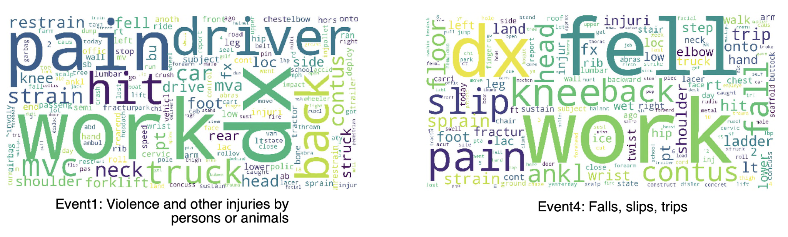
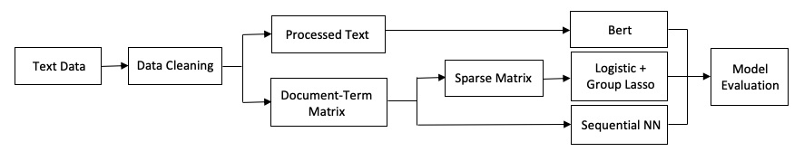

```{r setup, include = FALSE}
knitr::opts_chunk$set(echo = TRUE)
```


```{r, warning = FALSE,include = FALSE}

library(readr)
library(tm)
library(SnowballC)
library(ROCR)
library(glmnet)
library(rmarkdown)
library(knitr)
library(kableExtra)
library(ggplot2)
library(grid)
library(gridExtra)
library(png)

```

### <span style = "color:purple">1. Introduction </span>
\small
Every day, work-related injury records are generated. **In order to alleviate the human effort expended with coding such records**, the Centers for Disease Control and Prevention (CDC) National Institute for Occupational Safety and Health (NIOSH), in close partnership with the Laboratory for Innovation Science at Harvard (LISH), is interested in **improving their NLP/ML model to automatically read injury records and classify them** according to the Occupational Injury and Illness Classification System (OIICS). <span style = "color:purple">Our project is inspired by this initiative.</span>


This project represents a **text classification** problem that is expected to be solved using efficient **big dataset** handling techniques and various **classificiation algorithms**. Through exploration, we hope to achieve better accuracy and higher efficiency in injury records classification.

### <span style = "color:purple">2. Data Inspection</span>

A random sample of 153,956 records with the outcome event column included. The data have 4 column (text, age, sex and a response label): We have 48 unique OIICS response label in total. Given that the records were collected through document scanning, many spelling errors are included. For example, "S P" in record 3 (shown below).   

\scriptsize
```{r, size = 'scriptsize'}

Train <- read.csv("./data/CDC_Text_ClassificationChallenge_TrainData.csv")
head(Train, 3)
dim(Train)[1]
summary(Train$age)

```
\small
The response variable is hierarchical (for example, if one label is 32, then it belongs to the third class "Fires and Explosions", and the second type). Figure on the left is showing the 7 first level labels and a few second level labels (48 in total). Although there are 48 possible outcomes, the frequencies is extremely unbalanced, as shown in the figure on the right. This needs to be taken into account while training different models. 

```{r, include = FALSE}

load(file = "data/vector.rda")

VectorCountPlot <- ggplot(vector, aes(x = V2, y = sample_vector)) + geom_bar(stat = "identity", color = "white", fill = "lightblue") + theme(plot.title = element_text(hjust = 0.5))
print(VectorCountPlot + ggtitle("Count of Each Category") + labs(y = "count", x = "Category Label"))
ggsave("plot/vector.png")

img1 <- rasterGrob(as.raster(readPNG("./plot/response_data.png")), interpolate = FALSE)
img2 <- rasterGrob(as.raster(readPNG("./plot/vector.png")), interpolate = FALSE)

```

```{r echo = FALSE, out.width = '100%', fig.align = "center"}
grid.arrange(img1, img2, ncol = 2)
```


### <span style = "color:purple">3. Data Preprocessing and Prelimiary Analysis</span> 

**a) Data Cleaning **

In the text data cleaning part, we applied common text-cleaning techniques including changing all letters into lower-cases, removing punctuations, word stemmming and word lemmatization. Specifically, the age and gender information were already included in the original dataset, therefore, we removed this information from "injury description" by regular expression matching.

Our text data is scanned from hand-written records, there are some wrongly-scanned words and characters, and the preposition may matter in the classfication. Thus, we created our own stopping words list which excludes prepositions and includes single characters. Finally, we replaced those mis-spelled words with the correct ones. 
After cleaning, we produced an injury records corpus with 6,000 vocabulary.

**b) Build Document-Term Matrix **  

After the cleaned-version text was generated, we built a document-term matrix, where each row is a injury record, each column represents one unique word from the vocabulary, and the elements represent the vocabulary matrix.
Given that this matrix is very space-consuming, we transformed it into **sparse-matrix** form.

We then visulized the high frequency words in each injury category to see whether the dominant words differ among the 7 categories. This helps us illustrate the effectiveness of our document-term matrix in subsequent model fitting process.
Below are two word cloud examples for class 1: *Violence and other injuries by animals or person* and class 4: *Falls, slips, trips*

 


**c) Dimension reduction:** 

For traditional methods, we will use document-word matrix as input. Although we use **sparse matrix** to store it, it is still "big". Thus we may try some dimension reduction methods:

   + We tried **LDA (Linear Discriminant Analysis)** to project high-dimensional, sparse data to a low-dimensional, dense space, supervised by training data;
   + We also tried **ANOVA test** on every single word and kept the significant ones only, which can reduce the dimension from 6000 to 2000.
   + But both methods reduced the accuracy in fact, due to the loss of information. Considering **lasso penalty** can choose the informative features automatically, we decided to use lasso penalty only rather than any other dimension reduction methods.
   
NLP methods do not process data as matrix, thus their corresponding "dimension reduction" is just different kinds of pre-processings.


### <span style = "color:purple">4. Models and Results </span> 

We applied three representative methods to this classification problem, where *logistic* methods are popular bacause of feasible interpretation, *Sequential NN* is a simple basic model with only 2 dense layers, and *BERT* is a complex pre-trained model.
Below is the pipeline of our whole work. 




**a) Logistic regression**

Firstly, we applied logistic regression. The logistic regression assume that data have the following distributions:$$ P(Y_i=j) = \frac{exp(x_i^T\beta_j)}{\sum_{m=1}^{k}exp(x_i^T\beta_m)}$$
We want to **maxmize** the object function:$$max \ Likelihood = \Pi_{i=1}^{n} \Pi_{j=1}^{k}[P(Y_i=j)]^{1_{Y_i=j}}$$
Or **minimize** the loss function:$$min \ Loss = -\sum_{i=1}^{n} \sum_{j=1}^{k}1_{Y_i=j}\times log[P(Y_i=j)]$$

  **Logistic regression with penalty, Group lasso:** $$min \ Loss = -\sum_{i=1}^{n} \sum_{j=1}^{k}1_{Y_i=j}\times log[P(Y_i=j)] + \lambda \sum_{i=1}^{p} \sqrt{ \sum_{j=1}^{k} \beta_{i,j}^2 }$$

We applied lasso to automatically select features. If one word is useful to predict one class, it can also be useful to predict others (e.g. “fire” is positive to class “burn”, then it is somehow negative to other class). Given that the sparse matrix still have many useless feature (i.e. noise), we apply group lasso to conquer this issue.


**Application of Logistic Regression**: 

We use sparse matrix as input to fit the logistic regression.

At first we use **cv.glmnet** to perform logistic regression, but it warned us with **unconvergence** (due to huge data), and failed to conduct any cross validation. (In fact, when data is big, cv.glmnet's stopping criteria seems to be arbitary and we cannot check the convergence. Its accuracy is between 0.75 - 0.79).

Thus we used the **biostatistic cluster** to train a logistic model with **self-written codes**, we only showed the result of one of the clustered-version logistic results here. Since we used group lasso with one additional penalty parameter $\lambda$, three results with different penalty were shown in the following figure (training accuracy is not the main concern, thus we presented the test accuracy only)

```{r, echo = FALSE, fig.align = "center", out.width = '55%'}

knitr::include_graphics("./plot/Logreg_acc.png")

```

**b) Neural Network: Sequential Model**

**Keras** is a high-level tool for coding and training **neural networks**. Here we use **Keras package** in r to fit a simple sequential model to our injury data. A **Neural Network** is a machine-learning algorithm made up of individual nodes called neurons. Neurons are arranged into a series of groups called **layers**. Nodes in each layer are connected to nodes in the following layer. Data flows from the input to the output along these connections.

The easiest way to build a neural network is to use the **Sequential Model** class, which represents a linear stack of layers. Choosing the right training features is the key. A Neural Network containing two hidden layers is shown below on the left. We built a 2-dense-layer network (only 1 hidden layer), the first one with dimension 300 and the last one with dimension 48.


```{r, echo = FALSE, fig.align = "center"}

# img3 <- rasterGrob(as.raster(readPNG("./Sequential NN/NotedNN.png")), interpolate = FALSE)
# img3 <- rasterGrob(as.raster(readPNG("./Sequential NN/TextNN.png")), interpolate = FALSE)
img3 <- rasterGrob(as.raster(readPNG("./SequentialNN/TextNN.png")), interpolate = FALSE)
img4 <- rasterGrob(as.raster(readPNG("./SequentialNN/SNNplot.png")), interpolate = FALSE)
grid.arrange(img3, img4, ncol = 2)

```
Sequential Models of different layers have been fitted to categorize injury records. After a very time-consuming tuning process, a single layer model showed the best testing accuracy. As shown in the figure above (on the right), even though training accuracy keeps increasing as epoch increases, testing accuracy stays at around **0.83** after epoch = 4 .

**c) Neural Network: BERT Pre-trained Model **

**BERT** (Bidirectional Encoder Representations from Transformers) is another neural network model, and applying this pre-trained model to our dataset is a kind of **Transfer Learning**. This deep and narrow nueral network model (12 layer with maximum dim 1024) has been trained by Google on large and high-quality text dataset, and it has achieved excellent performance in lots of NLP tasks. Hence, in our particular case, when we initialized our model with the **pre-trained** parameters, the model only needed to be fine tuned, saving enormous training time.

Compared to the two models above, the input matrix representation here is rather complicated, including both word, sentence and word position information. It is a huge nueral network with 1.2G parameters. In our small sample (10,000 records) trial, the training time with batch size 60 is 90 minutes for running each epoch. To conduct it in a less time-consuming manner, we decided to train the model with **GPU** in google colab.

After 7 epochs, the model seems to converge on test dataset with an accuracy of around 0.87.
```{r, echo = FALSE, fig.align = "center"}
bert <- rasterGrob(as.raster(readPNG("./Bert/Input_Layer.png")), interpolate = FALSE)
bertTrain <- rasterGrob(as.raster(readPNG("./Bert/bertPlot.png")), interpolate = FALSE)
grid.arrange(bert, bertTrain, ncol=2)
```


**d) Comparison among Models **

In experiments, the model precision and accuracy are recorded in order to carry out a comparison of different approaches. We will use *Weighted-F1* score as the metric for model assessment.
The input text represention of both traditional Logistic method and Sequential NN are the same, but the latter improves around 3% on both accuracy and weighted-F1 and runs 4.5 times faster than the former. Among all methods, BERT model performs the best on this classification problem; since it is the most complicated model, it has the longest estimated running time on CPU, while runs satisfacorily with a **GPU**.   
```{r, echo=FALSE}
res <- data.frame(
   Train_Accuracy = c(0.80,0.89, 0.93),
   Test_Accuracy = c(0.80, 0.83, 0.87),
   Weighted_F1 = c(0.79, 0.82, 0.87),
   Time = c("3h", "0.67h", "70h; 0.67h(GPU)"), 
   row.names = c("Logistic", "SequentialNN", "BERT")
)
kable(res, format = "latex",booktabs=TRUE) %>%
   kable_styling(latex_options = "striped")
```


### <span style = "color:purple">5. Conclusion and Future Work</span>
In this injury records classification project, different models have been applied and evaluated. At the exploratory stage, we explored various prevailing traditional and deep learning methods for classification purpose, and eventually focused on Logistic, Sequential NN and BERT models.

For a natural language problem, explaining the model may be complicated, since all vocabulary, word position and sentence as a whole may matter for the objective. BERT model makes full use of the information in each injury records, and achieves best result; however it is also the least efficient method. 

In Logistic model, only vocabulary frequency information are used and there are 6000 predictors (vocabularies). Even with *Group Lasso* there are lots of significant words for each injury category. Compared to the other two methods, its performance are not satisfactory.

In Sequential NN we only build a basic model with 2 dense layer along with the activation layer. It shows an excellent improvement on both weighted-F1 socre and efficiency compared with traditional Logitistic method. Its input matrix are also just document-term matrix, which shows that vocablary itself matters a lot in our classification problem. 

We may expect improvement on both logistic and the Sequential NN model by introducing pre-trained word embeddings in data pre-processing part. For example, before feeding data into models, we can project the high-dimension input matrix to low-dimension space with *Word2Vec*, *Doc2Vec* or *Glove*.


**Project Github**: <https://github.com/xietian99/DiseaseTextClassification>
