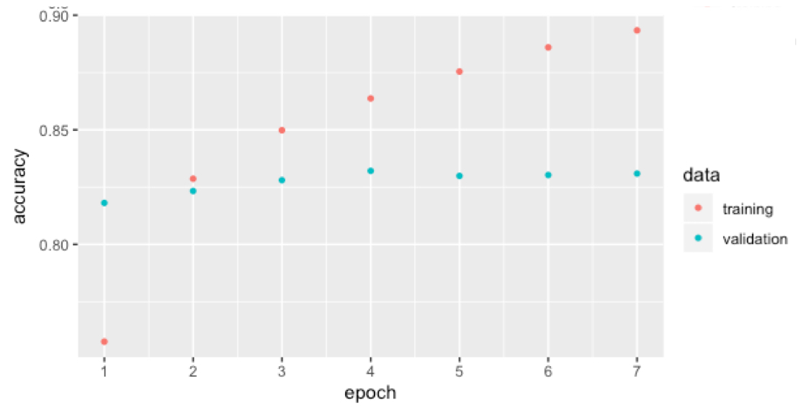

# DiseaseTextClassification
This is a final project for course Biostat 625 at Umich. In this injury records classification problem,
we focused on Logistic, SequentialNN and BERT models.

The code for each model are logisitic_cluster.R, Sequential NN.R, and Final625_BERT.ipynb.

The result are listed below:

Contributor: Chang WANG (wangchan@umich.edu), Sidi WANG(sidiwang@umich.edu), Tian XIE (xiet@umich.edu). 
Contribution: All our three conducted data prepossessing and preliminary analysis at the exploratory stage. Logistic is mainly contributed by Chang, Sequential NN mainly by Sidi and BERT mainly by Tian. The final report are drafted by all.
